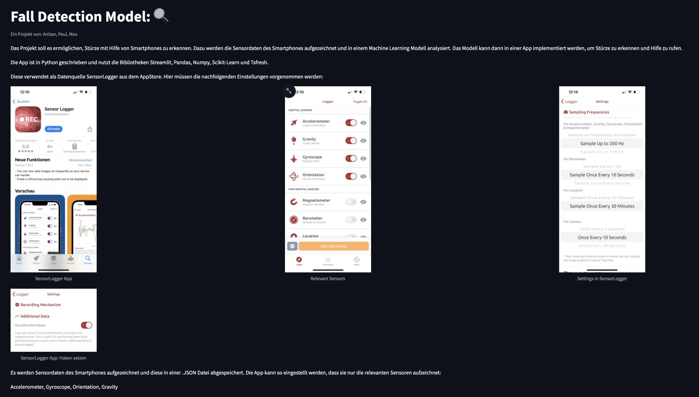
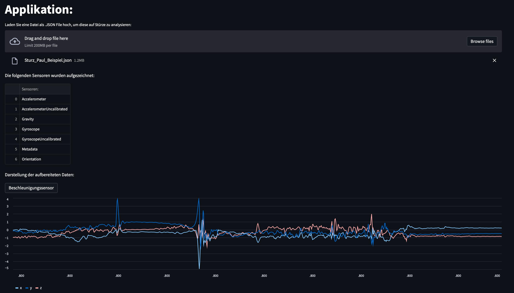
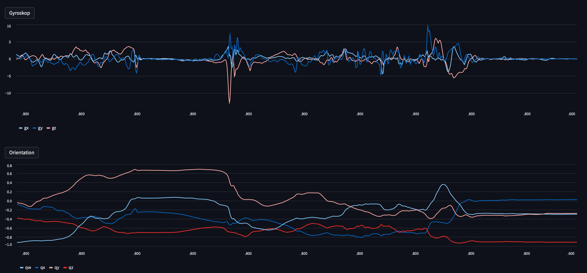
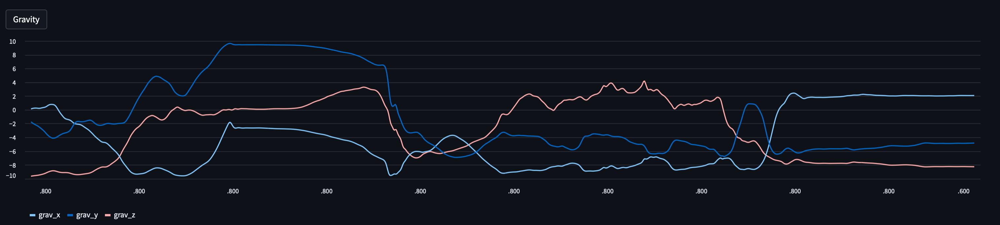
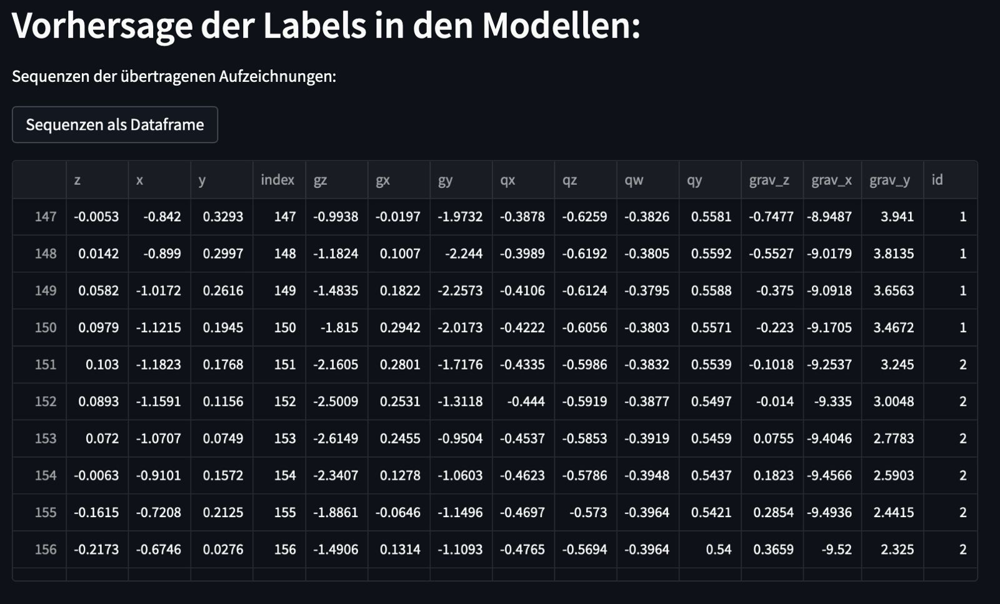

# FallDetector

FallDetector is a Streamlit prototype for detecting falls from smartphone motion sensor data. It uses recordings exported from the SensorLogger iOS app, extracts time-series features with `tsfresh`, and classifies each recording segment with pre-trained k-nearest neighbors and Random Forest models.

The project was created by Anitan, Paul, and Max as an applied machine learning project around smartphone-based fall detection.

## What the App Does

- Accepts SensorLogger `.json` exports through a Streamlit upload interface.
- Reads motion data from accelerometer, gyroscope, orientation, and gravity sensors.
- Cleans and aligns sensor streams into one combined time-series table.
- Splits recordings into sequences of 150 samples.
- Extracts statistical time-series features with `tsfresh`.
- Predicts whether each sequence is a normal movement or a fall.
- Shows raw and processed sensor plots for visual inspection.
- Compares predictions from two trained models:
  - k-nearest neighbors
  - Random Forest

## Interface Preview

The Streamlit interface introduces the SensorLogger setup and the required sensor configuration.



After loading a SensorLogger recording, the app lists the detected sensors and visualizes the processed motion data.



The app can also display gyroscope, orientation, and gravity streams to inspect the movement pattern in more detail.





The recording is split into sequences before the trained models classify each segment.



## Project Structure

```text
.
+-- streamlit.py                       # Main Streamlit app
+-- pages/
|   +-- Motivation.py                  # Project motivation page
|   +-- requirements.py                # App requirements page
+-- data/                              # SensorLogger JSON recordings
+-- pictures/                          # SensorLogger setup screenshots
|   +-- streamlit_header.jpeg          # Streamlit start and setup view
|   +-- streamlit_accelorator.jpeg     # Uploaded recording and accelerometer plot
|   +-- streamlit_gyro.jpeg            # Gyroscope and orientation plots
|   +-- streamlit_gravity.jpeg         # Gravity plot
|   +-- streamlit_labels.jpeg          # Sequence table and model section
+-- FallDetection_Abgabe_final.ipynb   # Final training and analysis notebook
+-- alterCode/                         # Earlier notebooks and experiments
+-- knnpickle_file                     # Trained k-nearest neighbors model
+-- rfpickle_file                      # Trained Random Forest model
+-- featuresList_file                  # Feature list used by the models
+-- requirements.txt                   # Python dependencies
```

## Data Source

The recordings in `data/` were collected with the SensorLogger app. Each JSON file contains timestamped sensor rows and metadata. The Streamlit app expects SensorLogger-style JSON with the following sensor types enabled:

- `AccelerometerUncalibrated`
- `GyroscopeUncalibrated`
- `Orientation`
- `Gravity`

The repository also contains example recordings for normal daily activities and fall-like movements, including walking, sitting down, lying down, stair walking, and standing falls.

## Machine Learning Workflow

The model workflow is documented in `FallDetection_Abgabe_final.ipynb`:

1. Load SensorLogger JSON recordings.
2. Split recordings into fall and non-fall examples.
3. Select the relevant sensor columns:
   - acceleration: `x`, `y`, `z`
   - gyroscope: `gx`, `gy`, `gz`
   - orientation quaternion: `qx`, `qy`, `qz`, `qw`
   - gravity: `grav_x`, `grav_y`, `grav_z`
4. Merge sensor streams by generated sample index.
5. Split the combined data into 150-sample sequences.
6. Extract relevant features with `tsfresh`.
7. Train and evaluate k-nearest neighbors and Random Forest classifiers.
8. Store the trained models and selected feature list as pickle files.

The notebook reports an accuracy of about 85 percent for both the k-nearest neighbors and Random Forest test runs.

## Application Output

For an uploaded SensorLogger recording, the app displays the detected sensors, optional plots of the processed sensor streams, the extracted sequence table, and the model predictions. Predictions are shown separately for the k-nearest neighbors and Random Forest models.

Predictions are shown per 150-sample sequence as either `Normal` or `Fall`.

## Limitations

This project is a prototype and is not a medical or safety-certified fall detection system. The models were trained on a limited project dataset, and prediction quality depends heavily on sensor placement, phone model, recording settings, movement type, and the similarity between new recordings and the training data.

Before using the approach in a real-world scenario, the system should be evaluated with a larger and more diverse dataset, cross-device recordings, clearer train/test separation, and real-time alert handling.

## References

- [ScienceDirect: Fall detection system using data from smartphone sensors](https://www.sciencedirect.com/science/article/pii/S1877050918318398)
- [KTH DiVA thesis on fall detection](https://kth.diva-portal.org/smash/get/diva2:1230962/FULLTEXT01.pdf)
- [Fall Detection Using Machine Learning Algorithms](https://www.researchgate.net/publication/308467199_Fall_Detection_Using_Machine_Learning_Algorithms)
- [Latest Research Trends in Fall Detection and Prevention Using Machine Learning](https://www.researchgate.net/publication/353576862_Latest_Research_Trends_in_Fall_Detection_and_Prevention_Using_Machine_Learning_A_Systematic_Review)
- [Journal of NeuroEngineering and Rehabilitation: fall detection review](https://jneuroengrehab.biomedcentral.com/articles/10.1186/s12984-021-00918-z)
